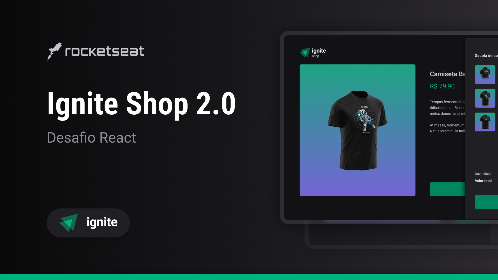

# Ignite Shop

<p align="center">
  
</p>

#### Acesse o [link do deploy](https://ignite-shop-ten-steel.vercel.app/), adicione produtos no carrinho e finalize a compra utilizando os seguintes dados no pagamento:

```
Número do cartão: 4242 4242 4242 4242
Validade: qualquer data futura no formato > 12/34
CVV: qualquer combinação de 3 digitos > 123
```

## 🚀 Tecnologias

Esse projeto foi desenvolvido com as seguintes tecnologias:

- NextJS
- Stitches
- Stripe API
- Axios
- Keen Slider
- Lucide

## 💻 Projeto

O Ignite Shop é um ecommerce de vendas de camisetas
